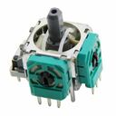
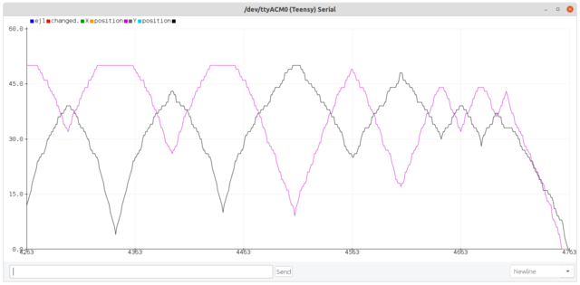

# EventJoystick

> **The new version of EventJoystick can now be found in the [InputEvents library](https://github.com/Stutchbury/InputEvents).**

Based on [EventAnalog](https://github.com/Stutchbury/EventAnalog), this is an event based library for analog joysticks - slice the analog range of each axis into a configurable number of increments and a callback will be fired on each change of increment. 

Start and end (ie centre and edge for joysicks) 'deadzones' can be configured - the button on small joysticks is difficult to press wothout moving the stick and the edge values are unreliable.

Originally I was going to integrate the button that is common on many joysticks as per [EncoderButton](https://github.com/Stutchbury/EncoderButton) but for the small thumbsticks, it is nigh on impossible to keep the button pressed while moving the stick. Use [EventButton](https://github.com/Stutchbury/EventButton) for your joystick button events.

As with the other event libraries, an idle timeout callback is included.



## INSTALLATION & DOWNLOAD
Install via the Arduino Library Manager or download from [github](https://github.com/Stutchbury/EventJoystick).

## BASIC USAGE

### INSTANTIATE

```cpp
#include <EventJoystick.h>
EventJoystick ej1(<ANALOG_PIN>);

// Create one or more callback functions 
void onEj1Changed(EventJoystick& ej) {
  Serial.print("ej1 changed. X position: ");
  Serial.print(ej.x.position());
  Serial.print(", Y position: ");
  Serial.println(ej.y.position());
}
```

### SETUP

```cpp
// Link the event(s) to the function(s) defined above. This is a joystick event that will provide access to both axis. It is possible to attach callbacks to individual axis if required. (see examples)
ej1.setChangedHandler(onEj1Changed);

// Optionally set the number of increments you'd like. Default is 25. This is applied to both axis but each axis can be overridden after this is set.
ej1.setNumIncrements(15);

```
### LOOP

```cpp
// Call 'update' for every EventJoystick - you do not need to call the individual axis update() even if using callbacks for individual axis.
ej1.update();
```

## Constructors

Construct an EventJoystick
```cpp
EventJoystick(byte analogXPin, byte analogYPin);
```

## Loop method

There is only one method to be called from loop but it must be called for each defined ```EventJoystick```.  

**```void update()```** reads the state of both axis analog pins and fires the appropriate handlers. Do not call the individual axis ```update()``` even if you have defined separate callbacks on the axes.


## Setup methods

Normally called from within ```setup()``` but can be updated at runtime.

### Setting button callback handlers

Each of these methods (optionally) sets the function to be called on the event being fired. 

They take a single argument of your function name.

For an ESP8288/32 or Teensy you can also pass a class method - see [```ClassMethodLambdaCallback.ino```](https://github.com/Stutchbury/EventButton/tree/main/examples/ClassMethodLambdaCallback) in the ```EventButton``` examples.

**```setChangedHandler```** fires when the position of either axis changes.  
Note: this will be fired just once if both axis positions change in the update() cycle.


**```setIdleHandler```** fires after both axis of the EventJoystick have been idle for ```setIdleTimeout(ms)``` (default 10 seconds).

**```setNumIncrements(uint8_t)```** Split both axis analog range into this number of slices. Each axis can optionally be sliced individually after this has been set. Note: This library is intended to reduce the usual 0-1024 range of analogRead() to a much smaller, more manageable number of 'slices'. Higher numbers may not produce accurate results.

A changed callback will be fire each time the increment changes on either axis.

**```setNumNegativeIncrements(uint8_t)```** and **```setNumPositiveIncrements(uint8_t)```** Normally increments are set with ```setNumIncrements``` but you can also set the negative and positive sides individually.


**```setStartValue(uint16_t)```** Set the underlying analog value that equates to the zero position. Primarily used to set the centre for joysticks.

**```setStartBoundary(uint16_t)```** It is very difficult to press the joystick button without moving the stick so with this we can create a central 'deadzone'. Parameter in the analog value, not increment position. 

**```setEndBoundary(uint16_t)```** Create an outer 'deadzone' where joysticks are notoriously inconsistent. Parameter is the analog value, not the increment position.

**```setRateLimit(uint16_t ms)```** EventJoystick callbacks are normally fired on every loop() but to limit the number of events fired when the joystick is moved quickly, you can set a rate limit here. Note: A high rate limit may reduce responsiveness.


### Setting id or user state 

**```setUserId(unsigned int identifier)```** Set a user defined value to identify this EventJoystick instance. Not used by the library and does not have to be unique (defaults to 0). Useful when multiple joysticks call the same handler.  
Note: this is 'user' as in 'user of the library'. 


**```setUserState(unsigned int state)```** Set a user defined state for this EventJoystick instance. Eg enum for ON, OFF, INACTIVE etc. Not used by the library.

### Read EventJoystick state

From within your callback function:

**```int16_t x.position()```** and **```y.position()```**  Returns the current X or Y position - this is not the analog value but the mapped position of the increments you have defined. Can be negative if ```setStartValue```is greater than the minimum position (normal for joysticks).

**```int16_t x.previousPosition()```** and **```y.previousPosition()```** Returns the X or Y previous position - this is not the analog value but the mapped position of the increments you have defined.

**```hasChanged()```** Returns ```true``` if position of either axis has changed since previous ```update()```.

### Timeout

**```bool isIdle()```** Returns true if no activity on both axis for  longer than ```setIdleTimeout``` - irrespective of whether the idle (or changed) callback has been fired.

### Enabling/disabling the EventJoystick

**```void enable(bool=true, allowRead=false)```** Disabling the EventJoystick will prevent all events firing. Pass ```true``` to enable (default) or ```false``` to disable.
Passing ```allowRead``` to ```true``` will allow the analogRead, enabling the 'manual' setting of max negative/positive values whilst not firing callbacks.  
It is also possible to enable individual axis.

**```bool enabled()```** Returns ```true``` if either axis is enabled or ```false``` if both are disabled.


